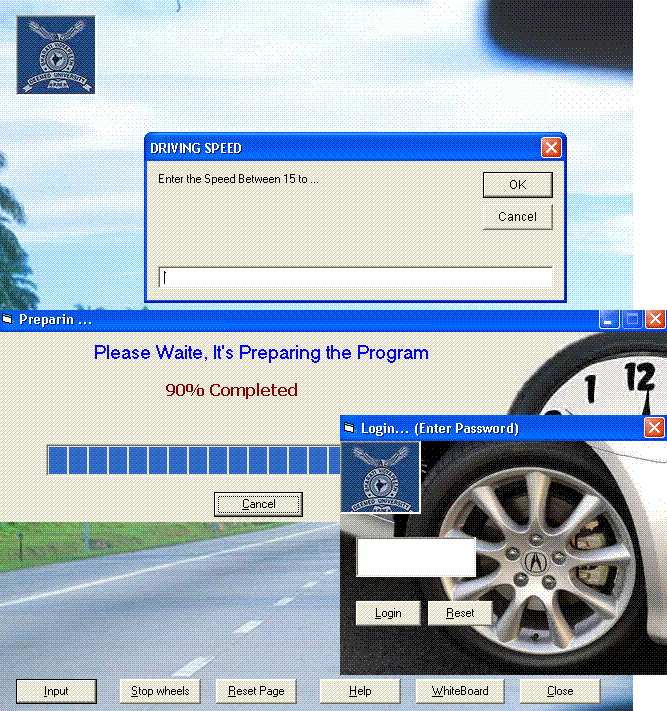



## Antilock Breaking System\(ABS\)

### Description

its showing how ABS(antilock breaking system) working,its include AniGif.ocx and some components(password is 1111)
 
### More Info
 
the Password is 1111

             |
---                |---
**Submitted On**   |2007-03-14 21:00:50
**By**             |[Amir Azhdari](https://github.com/Planet-Source-Code/PSCIndex/blob/master/ByAuthor/amir-azhdari.md)
**Level**          |Beginner
**User Rating**    |5.0 (10 globes from 2 users)
**Compatibility**  |VB 6\.0
**Category**       |[Object Oriented Programming \(OOP\)](https://github.com/Planet-Source-Code/PSCIndex/blob/master/ByCategory/object-oriented-programming-oop__1-47.md)
**World**          |[Visual Basic](https://github.com/Planet-Source-Code/PSCIndex/blob/master/ByWorld/visual-basic.md)
**Archive File**   |[Antilock\_B2054343172007\.zip](https://github.com/Planet-Source-Code/amir-azhdari-antilock-breaking-system-abs__1-68155/archive/master.zip)

